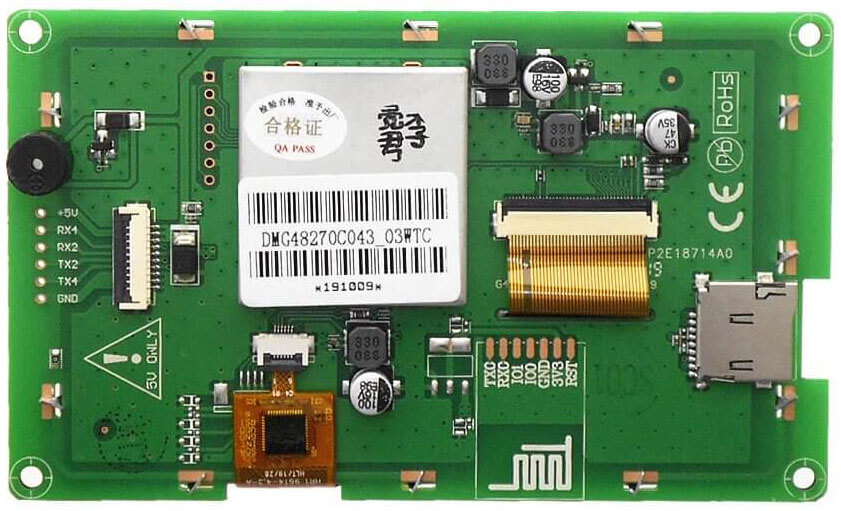
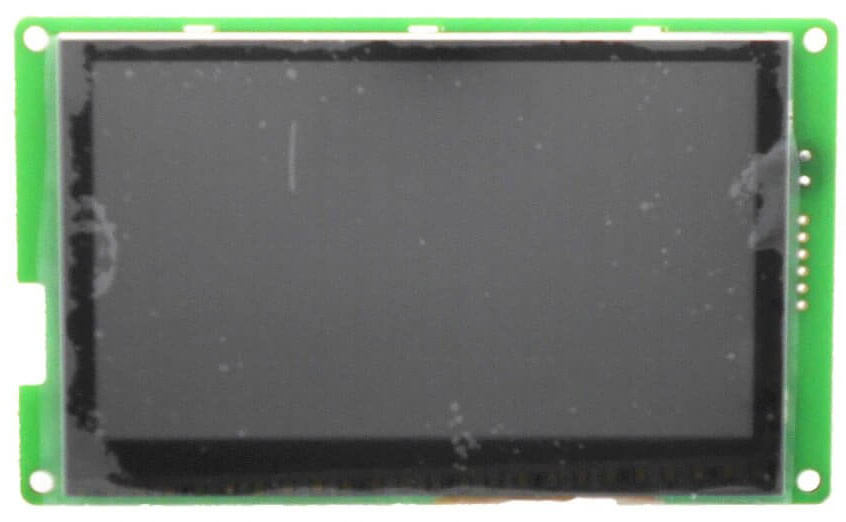
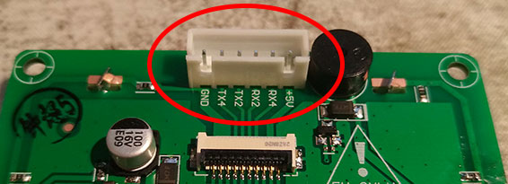
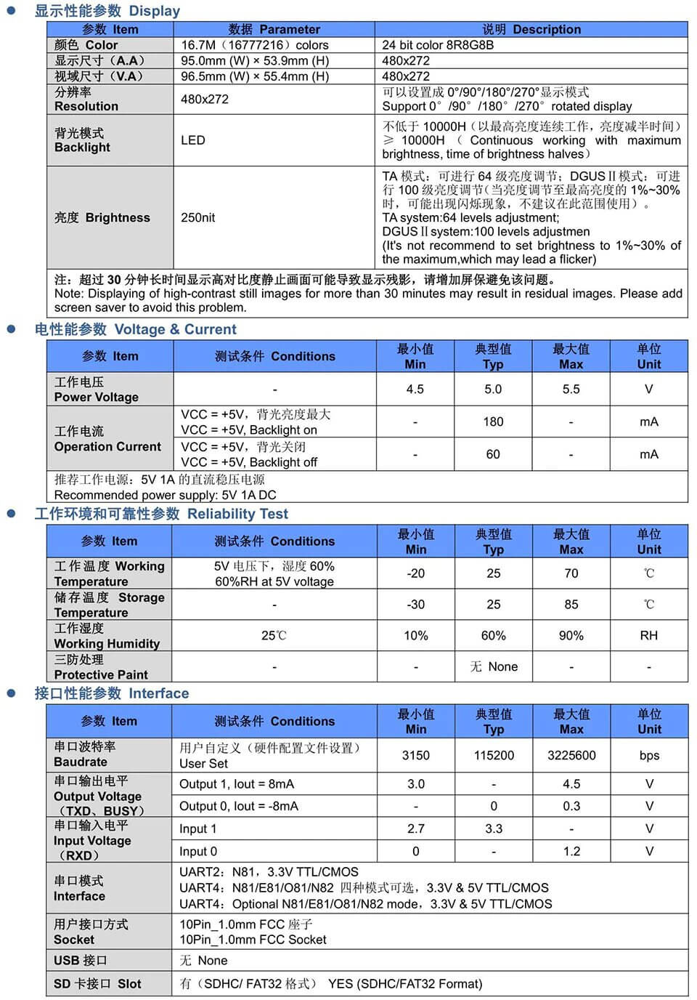
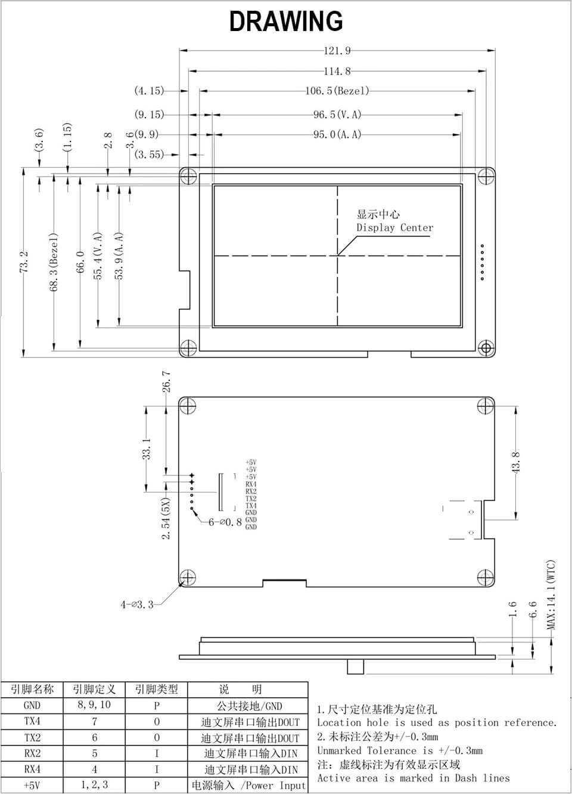

# Screen (alternative)

As Creality and DWIN aren't very cooperative to give us some technical details about the printer screen, we searched for other compatible screens.

Here's a working alternative: DWIN model DMG48270C043_03W

## Reference details

* DM = smart screen
* G = 24 bit color
* 48 = horizontal resolution code, 480px
* 270 = vertical resolution, 270px
* C = commercial classification
* 043 = 4.3 inches in diagonal
* _
* 0 = basic
* 3 = hardware version
* W = no meaning, internal (?)
* @ = touch screen capacities, can be:
  * TC = capacitive
  * TR = resistive
  * N = no touch
    
## Shopping

When this note was written, it was sold around 20€, shipping included.

Some links to sellers from AliExpress:

* https://www.aliexpress.com/item/4001022777228.html
* https://www.aliexpress.com/item/4000957474039.html
* https://www.aliexpress.com/item/1005002069287135.html
* https://www.aliexpress.com/item/4000446127137.html
* https://www.aliexpress.com/item/33037525947.html

Note: to connect it to your printer, you will have to solder a JST-XH 2.54mm 6 pins male connector (see the "pictures" section).

## Pictures

